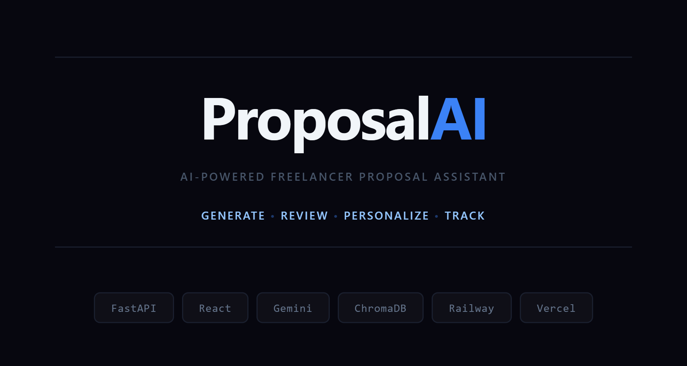
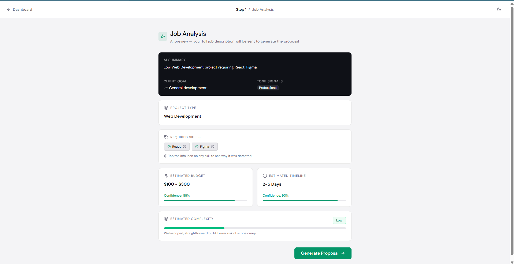
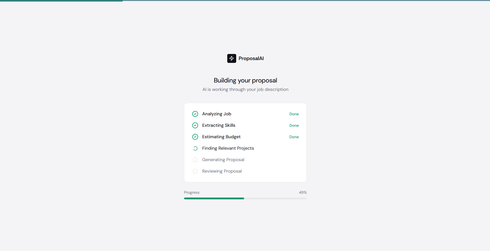
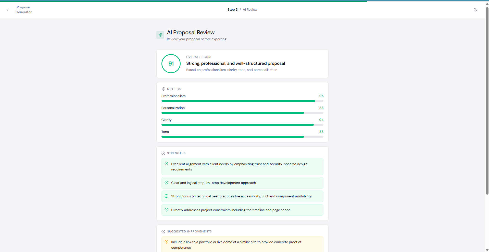
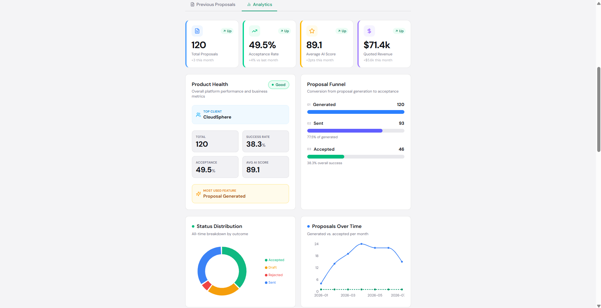
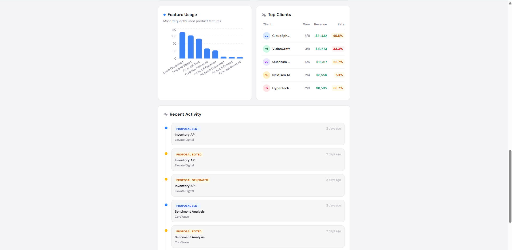
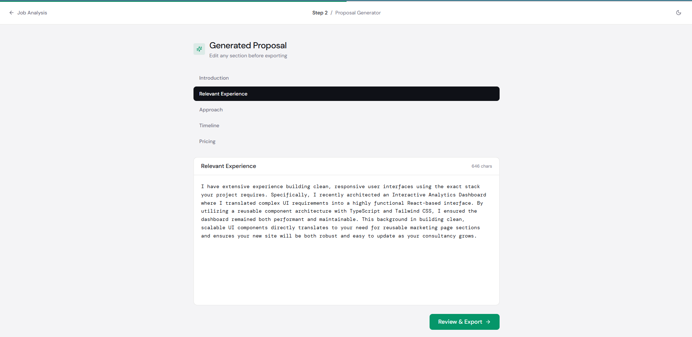
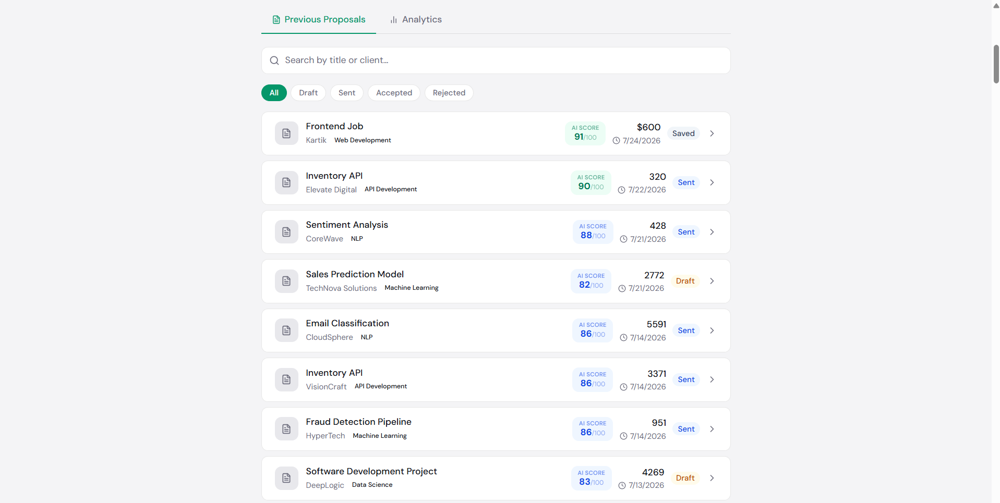
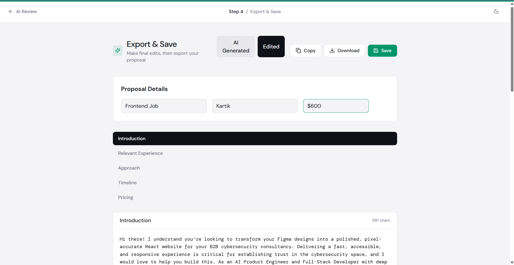
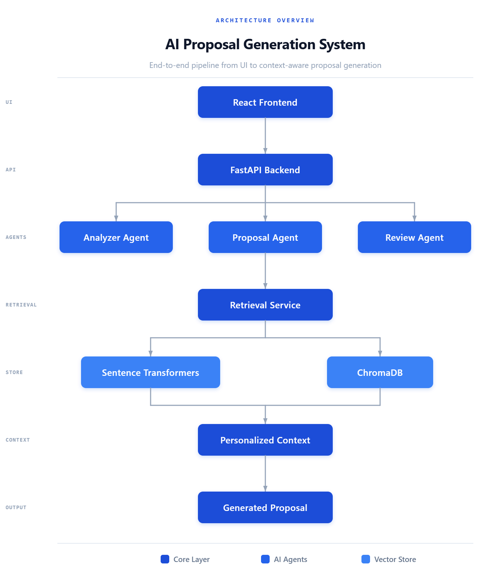

<div align="center">



# 🚀 AI Freelancer Proposal Assistant

**Generate personalized, high-quality freelance proposals in seconds using AI, Retrieval-Augmented Generation (RAG), and Product Analytics.**

<p align="center">
  
  
  
  
  
  
</p>

[**Live Demo**](https://freelancer-assistant.vercel.app/) · [**API Docs**](https://freelancer-assistant-production.up.railway.app/docs) · [**Report Bug**](https://github.com/kartik72006/freelancer-assistant/issues)

</div>

---

## 🎬 Demo

<div align="center">
  
</div>

| | |
|---|---|
| 🌐 **Frontend** | [freelancer-assistant.vercel.app](https://freelancer-assistant.vercel.app/) |
| ⚙️ **Backend API** | [freelancer-assistant-production.up.railway.app](https://freelancer-assistant-production.up.railway.app/) |
| 📚 **API Docs** | [/docs](https://freelancer-assistant-production.up.railway.app/docs) |

---

## 📌 Overview

Writing personalized freelance proposals is repetitive and time-consuming. Generic AI-generated proposals often fail because they lack personalization and relevant project experience.

**ProposalAI** solves this by combining:

- 🤖 AI-powered proposal generation
- 🧠 Retrieval-Augmented Generation (RAG)
- 🎯 Personalized project retrieval
- 📊 AI proposal review
- 📈 Product Analytics Dashboard

Instead of producing generic proposals, the application retrieves the user's most relevant past projects **before** generating the proposal — making every response significantly more personalized.

---

## ✨ Features

### 🤖 AI Proposal Generation



Paste in any job description and generate a complete freelance proposal, including:

- Personalized introductions
- Relevant experience
- Technical approach
- Timeline generation
- Pricing recommendations

---

### 🧠 Retrieval-Augmented Generation (RAG)



Instead of relying only on prompting, the application retrieves relevant portfolio projects before proposal generation:

- ChromaDB vector database
- Sentence Transformers embeddings
- Semantic similarity search
- Context formatting
- Intelligent project retrieval

---

### 📊 AI Proposal Review



Every generated proposal is evaluated by AI across:

- Overall AI Score
- Personalization
- Professionalism
- Clarity
- Tone
- Strengths & suggested improvements

---

### 📈 Product Analytics Dashboard





Track product performance with:

- Total proposals & proposal funnel
- Acceptance rate
- AI score trends
- Proposal trends & client insights
- Feature usage & product health metrics
- Recent activity

---

### 📁 Proposal Management







- Save, duplicate, and delete proposals
- Search proposal history
- Edit proposals
- Export proposals

---

## 🛠 Tech Stack

<table>
<tr>
<td valign="top" width="25%">

**Frontend**
- React
- TypeScript
- Vite
- TailwindCSS
- Radix UI
- Lucide Icons

</td>
<td valign="top" width="25%">

**Backend**
- FastAPI
- Python
- SQLAlchemy
- SQLite
- Repository Pattern
- Service Layer Architecture

</td>
<td valign="top" width="25%">

**AI Stack**
- Google Gemini
- OpenRouter
- Sentence Transformers
- ChromaDB
- RAG Pipeline

</td>
<td valign="top" width="25%">

**Deployment**
- Vercel (Frontend)
- Railway (Backend)

</td>
</tr>
</table>

---

## 🏗 System Architecture



```
                User
                  │
                  ▼
          React Frontend
                  │
                  ▼
            FastAPI Backend
                  │
      ┌───────────┼────────────┐
      │           │            │
      ▼           ▼            ▼
 Analyzer     Proposal      Review
   Agent        Agent         Agent
                  │
                  ▼
          Retrieval Service
                  │
      ┌───────────┼────────────┐
      ▼                        ▼
Sentence Transformers     ChromaDB
      │                        │
      └────────────┬───────────┘
                   ▼
         Relevant Projects
                   │
                   ▼
          Personalized Proposal
```

---

## 📂 Project Structure

```
Freelancer-Assistant/
├── agents/
│   ├── analyzer_agent.py
│   ├── proposal_agent.py
│   └── review_agent.py
├── api/
│   ├── routes/
│   ├── dependencies.py
│   └── main.py
├── database/
│   ├── models.py
│   ├── repositories/
│   └── db.py
├── services/
│   ├── ai/
│   ├── application/
│   └── retrieval/
├── knowledge_base/
├── frontend/
├── scripts/
└── docs/
```

---

## ⚙️ AI Workflow

```
Paste Job Description
        │
        ▼
   Analyze Job
        │
        ▼
Retrieve Relevant Projects
        │
        ▼
  Generate Proposal
        │
        ▼
  Review Proposal
        │
        ▼
   Save Proposal
        │
        ▼
Analytics Updated
```

---

## 📊 Product Metrics

The application tracks:

- Proposal Generation Funnel
- Proposal Success Rate
- AI Quality Score
- User Activity
- Client Insights
- Feature Usage
- Proposal Trends
- Acceptance Trends

---

## 🚀 Getting Started

### Clone Repository

```bash
git clone https://github.com/kartik72006/freelancer-assistant.git
cd freelancer-assistant
```

### Backend Setup

Create and activate a virtual environment:

```bash
python -m venv venv

# Windows
venv\Scripts\activate

# Mac/Linux
source venv/bin/activate
```

Install dependencies:

```bash
pip install -r requirements.txt
```

### Environment Variables

Create a `.env` file:

```env
GEMINI_API_KEY=YOUR_API_KEY
OPENROUTER_API_KEY=YOUR_API_KEY
OPENROUTER_BASE_URL=https://openrouter.ai/api/v1
ENVIRONMENT=development
ENABLE_RETRIEVAL_LOGGING=True
```

### Initialize Database

```bash
python database/init_db.py
```

### Build Vector Database

```bash
python scripts/build_embeddings.py
```

### Seed Demo Data (Optional)

```bash
python scripts/seed_demo_data.py
```

### Run Backend

```bash
uvicorn api.main:app --reload
```

### Frontend Setup

```bash
cd frontend
npm install
```

Create `.env`:

```env
VITE_API_BASE_URL=http://127.0.0.1:8000
```

Run:

```bash
npm run dev
```

---

## 📚 API Endpoints

<details>
<summary><strong>Analysis</strong></summary>

```
POST /analysis/analyze
```

</details>

<details>
<summary><strong>Proposal</strong></summary>

```
POST   /proposal/generate
POST   /proposal/save
GET    /proposal/history
GET    /proposal/stats
GET    /proposal/{id}
PUT    /proposal/{id}/status
PUT    /proposal/{id}/final
POST   /proposal/{id}/duplicate
DELETE /proposal/{id}
```

</details>

<details>
<summary><strong>Review</strong></summary>

```
POST /review/generate
```

</details>

<details>
<summary><strong>Analytics</strong></summary>

```
GET /analytics/dashboard
GET /analytics/top-clients
GET /analytics/proposal-trend
GET /analytics/ai-score-trend
GET /analytics/status-distribution
GET /analytics/product-health
GET /analytics/proposal-funnel
GET /analytics/recent-activity
GET /analytics/feature-usage
GET /analytics/acceptance-trend
```

</details>

---

## 🎯 Future Improvements

- [ ] User Authentication
- [ ] Multi-user Support
- [ ] PDF Proposal Export
- [ ] Stripe Subscription
- [ ] Proposal Templates
- [ ] Team Workspaces
- [ ] A/B Prompt Testing
- [ ] Email Integration
- [ ] Proposal Version History
- [ ] Real Freelancer Profile Import

---

## 📈 Learning Outcomes

This project demonstrates:

- Product Thinking & AI Product Engineering
- Retrieval-Augmented Generation (RAG)
- Prompt Engineering
- FastAPI Development
- React + TypeScript
- REST API Design
- Repository Pattern & Service Layer Architecture
- Product Analytics
- Deployment using Railway & Vercel

---

## 👨‍💻 Author

**Kartik Bansal**

[LinkedIn](https://www.linkedin.com/in/kartik-bansal-bb49802b0/) · [GitHub](https://github.com/kartik72006)

---

## ⭐ Support

If you found this project useful:

⭐ Star the repository · 🍴 Fork it · 🛠️ Contribute improvements

---

## 📄 License

This project is licensed under the MIT License.