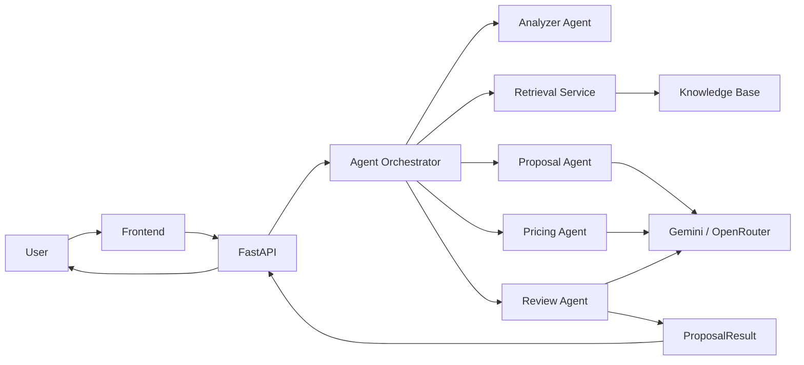
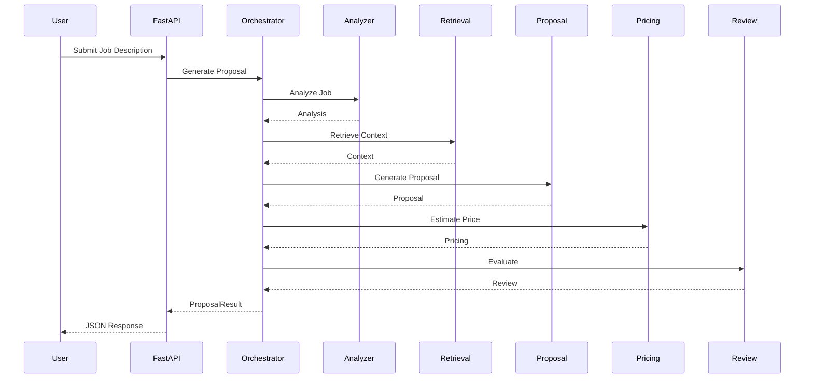

# AI Freelancer Proposal Assistant

# Engineering Design Document (EDD)

**Document Version:** 2.0 (Living Document)

**Project Version:** 0.3.0 (Week 3)

**Document Status:** Active Development

**Project Status:** Week 3 Complete — Transitioning to Backend Development

**Repository Type:** AI Product Engineering Portfolio Project

**Author:** Kartik Bansal

**Project Duration:** 56-Day AI Product Engineering Roadmap

**Start Date:** Day 1

**Current Milestone:** Day 21 — Engineering Documentation & Backend Transition

---

> **Confidentiality Notice**
>
> This document serves as the primary engineering reference for the AI Freelancer Proposal Assistant. It documents product decisions, software architecture, AI system design, engineering rationale, implementation strategy, and future evolution of the project.
>
> The document is maintained throughout the project's lifecycle and should be considered the single source of truth for engineering, architecture, and product-related decisions.

---

# Revision History

| Version | Date   | Status  | Description                                |
| ------- | ------ | ------- | ------------------------------------------ |
| 2.0     | Day 21 | Active  | Initial Engineering Design Document        |
| 2.1     | Week 4 | Planned | Backend API Architecture                   |
| 2.2     | Week 4 | Planned | Database Integration                       |
| 2.3     | Week 4 | Planned | Retrieval-Augmented Generation (RAG)       |
| 2.4     | Week 5 | Planned | Frontend Architecture                      |
| 2.5     | Week 6 | Planned | Analytics & Experimentation                |
| 2.6     | Week 7 | Planned | Product Strategy Expansion                 |
| 3.0     | Day 56 | Planned | Production-Ready Engineering Documentation |

---

# Document Purpose

The purpose of this Engineering Design Document (EDD) is to provide a comprehensive technical reference for the AI Freelancer Proposal Assistant.

Unlike traditional project reports or Product Requirement Documents (PRDs), this document captures both **product strategy** and **engineering implementation**, allowing readers to understand not only *what* the system does, but also *why* it was designed this way and *how* each component interacts with the rest of the platform.

The document is intended to evolve continuously throughout the development lifecycle and will be updated after every significant engineering milestone.

---

# Objectives

This document has six primary objectives:

1. Document the product vision and business problem.
2. Explain the complete software architecture.
3. Describe every AI subsystem and engineering decision.
4. Provide implementation guidance for contributors.
5. Record architectural evolution throughout development.
6. Serve as the definitive reference for future maintenance and scaling.

---

# Intended Audience

This document is intended for multiple stakeholders.

| Audience            | Purpose                                                       |
| ------------------- | ------------------------------------------------------------- |
| Product Managers    | Understand business goals and product decisions               |
| Software Engineers  | Understand architecture and implementation                    |
| AI Engineers        | Understand prompts, retrieval, evaluation, and AI pipeline    |
| Frontend Developers | Understand backend interfaces and API contracts               |
| Recruiters          | Evaluate project complexity and engineering maturity          |
| Interviewers        | Review architectural thinking and engineering decisions       |
| Future Contributors | Continue development without reverse engineering the codebase |
| Future Self         | Resume development months later with complete project context |

---

# Scope

This document covers the complete engineering lifecycle of the AI Freelancer Proposal Assistant, including:

* Product Discovery
* Product Strategy
* AI Engineering
* Backend Architecture
* Frontend Architecture (future)
* Product Analytics
* Evaluation Framework
* Deployment Strategy
* Software Design Decisions
* System Evolution

Implementation details that belong directly in source code (such as function-level comments or inline documentation) are intentionally excluded. Instead, this document focuses on system-level design and engineering rationale.

---

# How to Read This Document

Readers may approach this document differently depending on their goals.

* Product-focused readers should begin with **Part I – Product Foundation**.
* Engineers implementing features should begin with **Part III – System Architecture**.
* AI practitioners should focus on **Part V – AI Engineering**.
* Interviewers can review the Executive Overview, Architecture Decision Records, and Lessons Learned for a concise understanding of the project.

Cross-references between chapters are provided throughout the document to encourage non-linear reading when appropriate.

---

# Engineering Philosophy

The AI Freelancer Proposal Assistant is designed around a set of engineering principles that guide every architectural decision.

## User-Centric Design

Technology exists to solve user problems. Every engineering decision should ultimately improve the freelancer's experience.

## Modularity

Every major capability is isolated into an independent component that can evolve without affecting unrelated parts of the system.

## Separation of Concerns

Each module has one clearly defined responsibility. Business logic, orchestration, retrieval, prompt construction, evaluation, and configuration are deliberately separated.

## Extensibility

The architecture should support future additions—including semantic retrieval, authentication, analytics, and deployment—without requiring major redesign.

## Maintainability

Code organization should prioritize readability, testability, and long-term maintenance over short-term convenience.

## AI-First Architecture

The system is designed around AI workflows rather than retrofitting AI into an existing application. Components such as prompt engineering, retrieval, evaluation, and orchestration are treated as first-class architectural elements.

## Continuous Evolution

This document and the implementation are expected to evolve together. Architectural decisions should be revisited as the product matures, with significant changes recorded through Architecture Decision Records (ADRs).

---

# Documentation Conventions

To ensure consistency across all chapters, the following conventions are used throughout this document:

* Every chapter begins with its purpose and scope.
* All diagrams are numbered and captioned.
* Architectural decisions are recorded as ADRs.
* Future enhancements are documented rather than implied.
* Cross-references are used to connect related topics.
* Terminology remains consistent across product and engineering sections.

These conventions are intended to make the document easy to navigate, maintain, and expand over time.

# Chapter 1 — Executive Overview

---

## 1.1 Introduction

The **AI Freelancer Proposal Assistant** is an AI-powered application designed to automate one of the most repetitive and time-consuming activities performed by freelancers: writing personalized project proposals.

Instead of requiring users to manually analyze every job posting and repeatedly write proposals from scratch, the application combines modern Large Language Models (LLMs), retrieval techniques, prompt engineering, and multi-agent orchestration to generate high-quality, context-aware proposals in seconds.

Unlike traditional AI chatbots, this system is designed as a structured AI workflow rather than a single prompt-response interaction. Multiple specialized components collaborate to analyze a job description, retrieve relevant freelancer information, generate a tailored proposal, estimate pricing and project timelines, review the generated output, and produce a final response suitable for submission to freelance marketplaces.

The project serves two purposes:

1. Build a production-inspired AI application capable of solving a real user problem.
2. Demonstrate engineering practices expected in modern AI product teams, including modular software architecture, AI evaluation, prompt engineering, retrieval systems, backend development, and product analytics.

---

# 1.2 Executive Summary

Freelancers invest a significant amount of time preparing proposals for potential clients.

Although every proposal should ideally be personalized, the majority contain highly repetitive information describing the freelancer's experience, skills, previous projects, and working style.

As a result, freelancers repeatedly perform nearly identical work before they even have an opportunity to win a project.

The AI Freelancer Proposal Assistant reduces this repetitive effort by automating proposal creation while maintaining contextual relevance.

The application accepts a project description, understands the client's requirements, retrieves relevant information about the freelancer, generates a personalized proposal, estimates pricing and project duration, evaluates the generated response, and returns a polished proposal suitable for client submission.

Rather than acting as a replacement for freelancer expertise, the application functions as an intelligent copilot that accelerates repetitive work while allowing users to review and customize the final proposal.

---

# 1.3 Business Context

The freelance economy has experienced significant growth over the past decade.

Platforms such as Upwork, Fiverr, Freelancer, Contra, and Toptal allow professionals to access clients globally.

However, increased accessibility has also resulted in increased competition.

Freelancers frequently submit dozens of proposals each week.

Each proposal typically requires:

* Reading the project description.
* Understanding technical requirements.
* Matching relevant experience.
* Writing a personalized proposal.
* Estimating project duration.
* Estimating project cost.
* Reviewing the proposal before submission.

Although every project differs, much of this workflow is repetitive.

This repetition creates an opportunity for intelligent automation.

The AI Freelancer Proposal Assistant focuses specifically on reducing proposal preparation effort while preserving quality and personalization.

---

# 1.4 Product Vision

> **To become an intelligent AI copilot that enables freelancers to spend less time writing proposals and more time delivering high-quality work.**

The long-term vision extends beyond proposal generation.

As the platform evolves, it should become capable of learning from previous proposals, analyzing proposal performance, recommending improvements, retrieving historical work automatically, assisting with pricing decisions, and ultimately functioning as a complete AI productivity assistant for freelance professionals.

---

# 1.5 Mission Statement

Our mission is to combine modern AI capabilities with thoughtful product design to eliminate repetitive proposal writing while maintaining personalization, transparency, and user control.

The application should assist users rather than replace their professional judgment.

Every generated proposal should reflect the freelancer's own experience, skills, and style instead of producing generic AI-generated responses.

---

# 1.6 Project Objectives

The project has both product objectives and engineering objectives.

## Product Objectives

* Reduce proposal preparation time.
* Improve proposal quality and consistency.
* Increase proposal personalization.
* Improve freelancer productivity.
* Reduce repetitive manual work.
* Support better pricing decisions.

## Engineering Objectives

* Build a modular AI application.
* Demonstrate production-inspired backend architecture.
* Implement a multi-agent workflow.
* Apply Retrieval-Augmented Generation concepts.
* Build a reusable prompt engineering framework.
* Design an evaluation framework for AI-generated outputs.
* Expose the AI system through REST APIs.
* Prepare the project for frontend integration and future deployment.

---

# 1.7 Project Scope

### Current Scope (MVP)

The current implementation focuses on solving a single high-value workflow:

> Transforming a freelance job description into a personalized proposal using AI.

Current capabilities include:

* Job analysis
* Knowledge retrieval
* Proposal generation
* Pricing estimation
* Timeline estimation
* Proposal review
* AI evaluation
* Benchmark reporting

### Future Scope

Future iterations of the project may include:

* User authentication
* Persistent proposal history
* Semantic retrieval using embeddings
* Vector databases
* React frontend
* Analytics dashboard
* Proposal performance tracking
* Learning from accepted and rejected proposals
* Multi-user support
* Cloud deployment

---

# 1.8 Success Definition

The success of this project will not be measured solely by whether an AI model can generate text.

Instead, success is defined by the ability to design and implement a complete AI product that demonstrates sound product thinking, maintainable software architecture, engineering best practices, and measurable AI quality.

A successful implementation should satisfy the following criteria:

* The application solves a genuine user problem.
* The architecture remains modular and extensible.
* Individual components can evolve independently.
* AI outputs are evaluated rather than blindly accepted.
* The system is prepared for future production deployment.
* Documentation remains synchronized with implementation throughout the project lifecycle.

---

# 1.9 Chapter Summary

This chapter introduced the motivation, business context, vision, mission, objectives, and scope of the AI Freelancer Proposal Assistant.

The remainder of this document builds upon these foundations by progressively describing the product design, software architecture, AI engineering workflow, backend implementation, evaluation strategy, and long-term evolution of the system.

# Chapter 2 — Business Context & Product Discovery

---

# 2.1 Purpose

The purpose of this chapter is to establish the business context, user problem, market opportunity, and product rationale for the AI Freelancer Proposal Assistant.

Before discussing software architecture or implementation details, it is important to understand **why the product exists**, **who it serves**, and **what problem it aims to solve**.

Every architectural decision described later in this document ultimately traces back to the business requirements defined in this chapter.

---

# 2.2 Background

The rapid growth of digital freelancing has fundamentally changed how professionals find work.

Freelance marketplaces such as Upwork, Fiverr, Freelancer, Contra, Toptal, and PeoplePerHour allow individuals to work with clients across the world without geographical limitations.

While these platforms have created unprecedented opportunities, they have also introduced significant competition.

A freelancer may compete against hundreds of applicants for a single project.

As competition increases, proposal quality becomes one of the most important factors influencing whether a client responds.

Unfortunately, creating a high-quality proposal is also one of the most repetitive activities freelancers perform.

The same experience, skills, achievements, portfolio projects, and technical capabilities are repeatedly rewritten for every application.

Although every proposal must be personalized, much of the information remains largely unchanged.

This repetitive workflow creates an ideal opportunity for intelligent automation.

---

# 2.3 Market Opportunity

Modern freelancers increasingly rely on AI-assisted productivity tools.

AI is already used for:

* Code generation
* Image creation
* Email drafting
* Meeting summaries
* Documentation
* Customer support
* Marketing copy

However, proposal writing remains largely fragmented.

Current approaches generally fall into one of three categories:

1. Manual proposal writing.
2. Generic AI chatbot prompting.
3. Reusing old proposal templates.

Each approach introduces limitations that reduce productivity or proposal quality.

The AI Freelancer Proposal Assistant addresses this gap by combining structured workflows, retrieval, prompt engineering, and evaluation into a dedicated proposal generation system.

---

# 2.4 Problem Statement

The core problem addressed by this project can be summarized as follows:

> **Freelancers repeatedly spend valuable time producing personalized proposals that contain a large amount of repetitive information, reducing productivity and limiting the number of quality opportunities they can pursue.**

This problem is characterized by four major challenges:

### Repetition

Freelancers repeatedly describe:

* Skills
* Experience
* Portfolio
* Technical expertise
* Working methodology

even when applying to similar projects.

---

### Personalization

Clients expect proposals tailored to their project.

Copy-pasting previous proposals generally results in lower engagement and lower response rates.

---

### Pricing Uncertainty

Especially for new freelancers, estimating an appropriate project budget is difficult.

Incorrect pricing often reduces competitiveness.

---

### Lack of Learning

Most freelancers receive little structured feedback explaining why proposals succeed or fail.

Without feedback, proposal quality improves slowly over time.

---

# 2.5 User Research Summary

Product discovery activities completed during Week 1 identified two primary user segments.

## Primary Persona — Anita

Characteristics:

* Experienced freelancer
* High proposal volume
* Values efficiency
* Works across multiple projects simultaneously

Pain Points:

* Proposal writing consumes significant time.
* Repetitive work reduces productivity.
* Manual customization slows application speed.

Desired Outcome:

Spend more time delivering projects and less time writing proposals.

---

## Secondary Persona — Gauransh

Characteristics:

* New freelancer
* Limited proposal experience
* Unsure about pricing
* Needs structured guidance

Pain Points:

* Difficulty writing persuasive proposals.
* Uncertainty about project pricing.
* Lack of confidence.

Desired Outcome:

Generate professional proposals while learning industry best practices.

---

# 2.6 Jobs To Be Done (JTBD)

The project is based on the Jobs To Be Done framework developed during product discovery.

### Functional Job

> Help freelancers quickly create personalized proposals that accurately reflect their skills and experience.

---

### Emotional Job

> Reduce the stress associated with repeatedly writing proposals while increasing confidence before submission.

---

### Social Job

> Present freelancers as professional, credible, and well-prepared candidates.

---

# 2.7 Existing Workflow

Current proposal creation process:

```text
Find Job
    ↓
Read Description
    ↓
Research Client
    ↓
Think About Experience
    ↓
Write Proposal
    ↓
Estimate Timeline
    ↓
Estimate Pricing
    ↓
Review Proposal
    ↓
Submit
```

Estimated effort per proposal:

15–30 minutes

For freelancers submitting 40 proposals per week:

Approximately **10–20 hours** are spent solely on proposal preparation.

---

# 2.8 Pain Point Analysis

| Stage               | Pain Point                 | Impact |
| ------------------- | -------------------------- | ------ |
| Reading Job         | Understanding requirements | Medium |
| Writing Proposal    | Repetitive work            | High   |
| Personalization     | Time-consuming             | High   |
| Pricing             | Uncertainty                | Medium |
| Timeline Estimation | Experience dependent       | Medium |
| Review              | Manual proofreading        | Medium |
| Learning            | No structured feedback     | High   |

The greatest opportunity lies in reducing repetitive writing while preserving personalization.

---

# 2.9 Opportunity Analysis

The AI Freelancer Proposal Assistant introduces value at multiple stages of the workflow.

| Workflow Stage       | AI Opportunity                                  |
| -------------------- | ----------------------------------------------- |
| Requirement Analysis | Automatic extraction of skills and deliverables |
| Proposal Writing     | Personalized proposal generation                |
| Pricing              | Intelligent cost estimation                     |
| Timeline             | Project duration prediction                     |
| Review               | AI quality evaluation                           |
| Learning             | Proposal analytics and recommendations (future) |

Instead of replacing freelancers, the product augments their decision-making process.

---

# 2.10 Why Not Just Use ChatGPT?

A common question is why freelancers cannot simply use a general-purpose AI chatbot.

While conversational AI can generate proposals, it lacks several capabilities required for a production-ready workflow.

| Generic AI                  | AI Freelancer Proposal Assistant |
| --------------------------- | -------------------------------- |
| Single prompt               | Multi-stage workflow             |
| No structured analysis      | Dedicated job analysis           |
| No user knowledge retrieval | Retrieves portfolio and skills   |
| No pricing logic            | Specialized pricing agent        |
| No proposal evaluation      | Built-in review workflow         |
| No engineering architecture | Modular AI system                |
| Limited reuse               | Extensible platform              |

The value of this project lies not only in the AI model but also in the surrounding system architecture.

---

# 2.11 Product Positioning

The AI Freelancer Proposal Assistant is positioned as an **AI Copilot for Freelancers** rather than a simple text-generation tool.

Its primary value proposition is:

> **Transform repetitive proposal writing into an intelligent, structured, and continuously improving workflow.**

This positioning allows the product to evolve into a broader freelance productivity platform over time.

---

# 2.12 Chapter Summary

This chapter established the business motivation for the AI Freelancer Proposal Assistant by examining the freelance market, user research findings, workflow analysis, pain points, and market opportunity.

The product exists not because AI can generate text, but because freelancers face a repetitive, high-frequency workflow that benefits from intelligent automation.

The next chapter translates these business insights into product strategy, defining goals, success metrics, priorities, and the long-term vision for the platform.

# Chapter 3 — Product Strategy

---

# 3.1 Purpose

This chapter defines the strategic direction of the AI Freelancer Proposal Assistant. It translates user problems identified during product discovery into measurable objectives, product principles, engineering priorities, and long-term business goals.

Where the previous chapter explained **why the product should exist**, this chapter defines **what success looks like** and **how engineering decisions support business outcomes**.

---

# 3.2 Product Vision

The AI Freelancer Proposal Assistant aims to become an intelligent AI copilot that assists freelancers throughout the proposal lifecycle rather than acting as a standalone text-generation tool.

The long-term vision extends beyond proposal writing. The platform should eventually assist users with:

* Understanding client requirements.
* Retrieving relevant portfolio examples.
* Generating personalized proposals.
* Estimating realistic pricing.
* Predicting project timelines.
* Evaluating proposal quality.
* Learning from previous proposal outcomes.
* Improving future proposal recommendations.

The objective is to build an AI-assisted productivity platform that increases freelancer efficiency while preserving personalization and professional judgment.

---

# 3.3 Product Mission

The mission of the project is:

> **Empower freelancers to create higher-quality proposals in significantly less time by combining AI automation with structured engineering workflows and product thinking.**

Automation should enhance the user's capabilities rather than replace their expertise.

The final proposal should always remain editable, transparent, and under the user's control.

---

# 3.4 Product Principles

Every feature developed during this project should align with the following principles.

## Principle 1 — User Before Technology

Technology exists to solve user problems.

Features that do not create measurable user value should not be implemented.

---

## Principle 2 — AI as a Copilot

The application assists users rather than replacing decision-making.

The user remains responsible for the final proposal.

---

## Principle 3 — Context Before Generation

High-quality outputs require high-quality context.

Understanding the project and retrieving relevant user information should always occur before proposal generation.

---

## Principle 4 — Modular Intelligence

Every AI capability should be implemented as an independent module.

Examples include:

* Job Analysis
* Retrieval
* Proposal Generation
* Pricing
* Review
* Evaluation

Independent modules improve maintainability, testing, and future extensibility.

---

## Principle 5 — Measure Everything

Every important capability should eventually have measurable metrics.

Examples include:

* Proposal generation latency
* Proposal quality score
* Acceptance rate
* User satisfaction
* API response time

Engineering decisions should be supported by measurable outcomes whenever possible.

---

# 3.5 Product Goals

The project is guided by a combination of user-focused and engineering-focused goals.

## Primary Product Goals

* Reduce proposal writing time by at least 80%.
* Generate highly personalized proposals.
* Improve consistency across proposals.
* Reduce repetitive manual work.
* Increase freelancer productivity.
* Build user confidence during proposal submission.

---

## Engineering Goals

* Design a modular AI architecture.
* Implement reusable prompt engineering workflows.
* Support Retrieval-Augmented Generation.
* Expose functionality through REST APIs.
* Enable future frontend integration.
* Support production deployment.
* Maintain clean software architecture.

---

# 3.6 Success Metrics

Success is measured through multiple categories rather than a single KPI.

## Product Metrics

| Metric                         | Target                      |
| ------------------------------ | --------------------------- |
| Proposal Generation Time       | Less than 2 minutes         |
| Proposal Personalization Score | High                        |
| Proposal Regeneration Rate     | Low                         |
| User Satisfaction              | High                        |
| Proposal Acceptance Rate       | Higher than manual baseline |

---

## AI Quality Metrics

| Metric             | Purpose                                 |
| ------------------ | --------------------------------------- |
| Relevance          | Measures alignment with job description |
| Completeness       | Measures missing information            |
| Professional Tone  | Evaluates communication quality         |
| Hallucination Rate | Detect unsupported claims               |
| Consistency        | Evaluate proposal structure             |

---

## Engineering Metrics

| Metric             | Purpose                   |
| ------------------ | ------------------------- |
| API Response Time  | Backend performance       |
| Error Rate         | System reliability        |
| Test Coverage      | Software quality          |
| Retrieval Accuracy | Knowledge matching        |
| Evaluation Latency | AI evaluation performance |

---

# 3.7 Product Scope

The project follows an incremental development strategy.

## Phase 1 — MVP (Current)

Current focus:

* Job analysis
* Knowledge retrieval
* Proposal generation
* Pricing estimation
* Review workflow
* Evaluation framework

---

## Phase 2 — Backend Platform

Planned capabilities:

* FastAPI
* REST APIs
* Database
* Request validation
* Swagger documentation

---

## Phase 3 — User Experience

Future capabilities:

* React frontend
* Dashboard
* Proposal editor
* Proposal history
* Authentication

---

## Phase 4 — AI Intelligence

Future enhancements:

* Embeddings
* Semantic retrieval
* Learning from proposal outcomes
* Personalized recommendations
* Multi-model routing

---

## Phase 5 — Production Platform

Long-term objectives:

* Cloud deployment
* Analytics
* Monitoring
* Experimentation
* Team collaboration
* Multi-user support

---

# 3.8 Out of Scope

The following features are intentionally excluded from the current roadmap:

* Client communication platform
* Invoice generation
* Payment processing
* Marketplace bidding automation
* CRM functionality
* Time tracking
* Team management

Excluding these features allows the project to remain focused on solving one problem exceptionally well.

---

# 3.9 Product Roadmap Alignment

The engineering roadmap is intentionally aligned with the product strategy.

| Roadmap Phase | Strategic Objective                                           |
| ------------- | ------------------------------------------------------------- |
| Week 1        | Understand users and define the problem                       |
| Week 2        | Learn measurement and product analytics                       |
| Week 3        | Build the AI core and engineering architecture                |
| Week 4        | Transform the system into a backend platform                  |
| Week 5        | Deliver a user-facing application                             |
| Week 6        | Measure product performance                                   |
| Week 7        | Improve business strategy and growth                          |
| Week 8        | Prepare the project for production and portfolio presentation |

Each stage builds upon the previous one, ensuring that technical implementation always supports a clearly defined product objective.

---

# 3.10 Product Risks

Several risks have been identified during planning.

| Risk                    | Potential Impact        | Mitigation Strategy                     |
| ----------------------- | ----------------------- | --------------------------------------- |
| Generic AI responses    | Low proposal quality    | Retrieval + specialized prompts         |
| Poor personalization    | Reduced acceptance rate | User profile and project retrieval      |
| Hallucinated experience | Loss of user trust      | Evaluation framework and review agent   |
| Poor architecture       | Difficult maintenance   | Modular design and dependency injection |
| Prompt degradation      | Inconsistent outputs    | Prompt versioning and evaluation        |

Future revisions of this document will include probability, severity, and ownership for each identified risk.

---

# 3.11 Product Success Definition

The AI Freelancer Proposal Assistant will be considered successful when:

* Freelancers spend significantly less time writing proposals.
* Proposal quality remains consistently high.
* AI-generated outputs require minimal editing.
* The software architecture remains maintainable and extensible.
* Every AI component can evolve independently.
* The system demonstrates engineering practices suitable for production environments.
* The project serves as both a valuable user tool and a comprehensive AI engineering portfolio.

Success is therefore measured by **user impact**, **engineering quality**, and **long-term scalability**, rather than by AI generation alone.

---

# 3.12 Chapter Summary

This chapter translated business opportunities into measurable product strategy.

The project now has clearly defined goals, guiding principles, success metrics, development phases, and strategic priorities that will influence every architectural decision described in subsequent chapters.

The next chapter introduces the functional and non-functional requirements that convert this strategy into concrete system capabilities.

# Chapter 4 — Requirements Engineering

---

# 4.1 Purpose

The purpose of this chapter is to formally define the functional and non-functional requirements of the AI Freelancer Proposal Assistant.

Requirements Engineering acts as the bridge between product strategy and software architecture. Every component implemented throughout this project must trace back to one or more requirements defined in this chapter.

The requirements described here represent the baseline functionality for the Minimum Viable Product (MVP) while also establishing the foundation for future product iterations.

---

# 4.2 Scope

This chapter defines:

* Functional Requirements
* Non-Functional Requirements
* User Stories
* Use Cases
* Acceptance Criteria
* Assumptions
* Constraints
* Requirement Traceability

Implementation details are intentionally excluded and are discussed in later architecture chapters.

---

# 4.3 Stakeholders

The following stakeholders influence the system requirements.

| Stakeholder        | Responsibilities    | Primary Interest                       |
| ------------------ | ------------------- | -------------------------------------- |
| Freelancer         | End User            | Fast, personalized proposal generation |
| Client             | Proposal Recipient  | High-quality and relevant proposals    |
| Product Manager    | Product Direction   | User value and roadmap                 |
| AI Engineer        | AI Workflow         | Prompt engineering and evaluation      |
| Backend Engineer   | API Development     | System reliability and scalability     |
| Frontend Developer | User Interface      | Smooth interaction with APIs           |
| Maintainer         | Long-term Evolution | Maintainability and documentation      |

---

# 4.4 Functional Requirements

Each functional requirement represents a capability that the system must provide.

---

## FR-001 — Job Description Analysis

### Description

The system shall analyze a user-provided job description to extract relevant information.

### Inputs

* Job Description

### Outputs

* Required Skills
* Technologies
* Deliverables
* Estimated Complexity
* Budget Signals
* Timeline Indicators

### Priority

High

---

## FR-002 — Knowledge Retrieval

### Description

The system shall retrieve relevant information from the internal knowledge base.

### Sources

* Profile
* Skills
* Projects
* Past Proposals

### Outputs

Relevant context ranked according to similarity.

Priority:

High

---

## FR-003 — Proposal Generation

### Description

The system shall generate a personalized proposal using the retrieved context and analyzed job requirements.

Priority:

Critical

---

## FR-004 — Pricing Estimation

The system shall estimate:

* Project Budget
* Estimated Timeline
* Pricing Justification

Priority:

High

---

## FR-005 — Proposal Review

The system shall evaluate the generated proposal.

Evaluation includes:

* Relevance
* Tone
* Completeness
* Professionalism
* Personalization

Priority:

High

---

## FR-006 — AI Evaluation

The system shall benchmark proposal quality using predefined evaluation criteria.

Outputs:

* Numerical Scores
* Markdown Reports
* CSV Reports

Priority:

Medium

---

## FR-007 — API Access (Week 4)

The system shall expose all major capabilities through REST APIs.

Priority:

Future

---

## FR-008 — User Interface (Week 5)

The system shall provide a web-based interface for proposal generation.

Priority:

Future

---

# 4.5 Non-Functional Requirements

Unlike functional requirements, non-functional requirements describe how the system should behave.

---

## Performance

* Proposal generation should complete within acceptable latency.
* APIs should respond consistently under expected workload.

---

## Reliability

* Invalid requests should be handled gracefully.
* Failures should produce meaningful error messages.

---

## Scalability

The architecture should support future integration with:

* PostgreSQL
* Vector Databases
* Docker
* Cloud Deployment

without significant redesign.

---

## Maintainability

The codebase should remain:

* Modular
* Readable
* Well documented
* Easily testable

---

## Security

The application should:

* Protect API keys.
* Validate user inputs.
* Prevent prompt injection where practical.
* Avoid exposing sensitive information.

---

## Extensibility

Future modules should be addable with minimal changes to existing components.

---

# 4.6 User Stories

The following user stories summarize the expected product experience.

---

### US-001

**As a freelancer**

I want to generate a personalized proposal

so that I can apply to projects more quickly.

---

### US-002

As a freelancer

I want pricing suggestions

so that I can confidently estimate project costs.

---

### US-003

As a freelancer

I want AI feedback

so that I can improve proposal quality before submission.

---

### US-004

As a beginner freelancer

I want proposal recommendations

so that I can learn professional proposal writing.

---

### US-005

As an experienced freelancer

I want reusable context

so that I do not repeatedly describe my experience.

---

# 4.7 Primary Use Case

## UC-001 — Generate Proposal

### Actor

Freelancer

### Trigger

The user submits a job description.

### Main Success Scenario

1. User submits project details.
2. System validates request.
3. Job Analyzer extracts requirements.
4. Retrieval Service searches the knowledge base.
5. Proposal Agent generates proposal.
6. Pricing Agent estimates budget.
7. Review Agent evaluates output.
8. System returns final proposal.

### Postcondition

The user receives a structured proposal ready for review and submission.

---

# 4.8 Acceptance Criteria

The MVP will be considered complete when:

* Job descriptions are successfully analyzed.
* Relevant knowledge is retrieved.
* Personalized proposals are generated.
* Pricing estimates are included.
* Review feedback is generated.
* Evaluation reports are produced.
* APIs expose the workflow.
* Documentation remains synchronized with implementation.

---

# 4.9 Assumptions

The current implementation assumes:

* Users provide accurate project descriptions.
* Knowledge base information is maintained by the user.
* LLM responses are available.
* Internet connectivity is available.
* AI providers remain accessible.

Future versions may reduce these assumptions through caching, offline support, or alternative providers.

---

# 4.10 Constraints

Current technical constraints include:

* JSON-based knowledge storage.
* Single-user architecture.
* No persistent database.
* No authentication.
* No semantic retrieval.
* Limited evaluation dataset.

These constraints are intentional for the MVP and will be addressed incrementally in later milestones.

---

# 4.11 Requirement Traceability Matrix

| Requirement | Product Goal             | Engineering Component |
| ----------- | ------------------------ | --------------------- |
| FR-001      | Faster proposal creation | Analyzer Agent        |
| FR-002      | Better personalization   | Retrieval Service     |
| FR-003      | Proposal quality         | Proposal Agent        |
| FR-004      | Pricing confidence       | Pricing Agent         |
| FR-005      | Better outputs           | Review Agent          |
| FR-006      | Continuous improvement   | Evaluation Framework  |
| FR-007      | Backend platform         | FastAPI               |
| FR-008      | Better UX                | React Frontend        |

This matrix ensures that every engineering component directly supports a product objective.

---

# 4.12 Chapter Summary

This chapter translated business strategy into concrete system requirements.

By defining functional capabilities, quality attributes, user stories, use cases, and acceptance criteria, it establishes a clear contract between product design and engineering implementation.

The following chapters will demonstrate how these requirements are realized through system architecture, AI workflows, backend design, and supporting infrastructure.

# Chapter 5 — High-Level System Architecture

---

# 5.1 Purpose

The purpose of this chapter is to describe the overall architecture of the AI Freelancer Proposal Assistant.

While previous chapters focused on business strategy and product requirements, this chapter introduces the technical structure of the application.

It explains how independent software components collaborate to transform a freelance job description into a complete proposal while maintaining modularity, scalability, maintainability, and future extensibility.

This chapter intentionally focuses on **system-level architecture**.

Detailed implementation of each component is covered in later chapters.

---

# 5.2 Architectural Philosophy

The AI Freelancer Proposal Assistant is **not** implemented as a single script that sends prompts to an LLM.

Instead, it is designed as a modular AI application composed of independent services, agents, data models, and orchestration logic.

Every architectural decision is guided by five principles:

* Separation of Concerns
* Single Responsibility
* Modularity
* Extensibility
* AI-First Design

Rather than viewing AI as a feature added to software, the application treats AI as the primary workflow around which the software architecture is built.

---

# 5.3 Architectural Style

The project follows a layered architecture with orchestration.

```mermaid
flowchart TD

User["User / Frontend"]

↓

API["FastAPI API Layer"]

↓

ORCH["Agent Orchestrator"]

↓

SERVICES["AI Services"]

↓

LLM["Language Model"]

↓

RESULT["Structured Response"]
```

Each layer has a clearly defined responsibility and communicates only with adjacent layers whenever possible.

This reduces coupling and simplifies future maintenance.

---

# 5.4 Architectural Layers

The system is divided into six logical layers.

---

## Layer 1 — Presentation Layer

Responsibilities:

* Accept user requests.
* Display results.
* Perform basic client-side validation.

Current Implementation:

* Python CLI

Future:

* React Frontend
* Dashboard
* Proposal Editor

---

## Layer 2 — API Layer

Responsibilities:

* Validate requests.
* Route endpoints.
* Serialize responses.
* Handle errors.
* Generate API documentation.

Technology:

FastAPI

Future capabilities include authentication, middleware, rate limiting, and monitoring.

---

## Layer 3 — Orchestration Layer

This layer represents the brain of the application.

The Agent Orchestrator coordinates every AI workflow.

Responsibilities include:

* Executing agents.
* Managing execution order.
* Passing intermediate outputs.
* Handling failures.
* Producing final responses.

Without this layer, every client would need to coordinate the AI workflow manually.

---

## Layer 4 — AI Services Layer

This layer contains specialized AI components.

Current services include:

* Analyzer Agent
* Retrieval Service
* Proposal Agent
* Pricing Agent
* Review Agent

Each component solves one problem exceptionally well.

This architecture enables independent prompt engineering, testing, and future model routing.

---

## Layer 5 — Knowledge Layer

Responsibilities:

* Store freelancer profile.
* Store projects.
* Store skills.
* Store historical proposals.

Current implementation:

JSON files.

Future implementation:

PostgreSQL

*

Vector Database

---

## Layer 6 — Infrastructure Layer

Responsibilities:

* Configuration
* Logging
* Environment variables
* LLM providers
* Monitoring

Future additions:

* Docker
* Redis
* Cloud deployment
* CI/CD

---

# 5.5 Overall System Architecture



This architecture represents the current MVP while also supporting future expansion.

---

# 5.6 Request Lifecycle

Every proposal request follows the same lifecycle.



The orchestrator acts as the central coordinator, ensuring each component executes in the correct sequence.

---

# 5.7 Component Responsibilities

| Component          | Responsibility             |
| ------------------ | -------------------------- |
| FastAPI            | API Gateway                |
| Agent Orchestrator | Workflow Coordination      |
| Analyzer Agent     | Requirement Extraction     |
| Retrieval Service  | Context Selection          |
| Proposal Agent     | Proposal Generation        |
| Pricing Agent      | Cost & Timeline Estimation |
| Review Agent       | Quality Evaluation         |
| Knowledge Base     | Structured User Context    |
| Configuration      | Shared Settings            |
| Models             | Data Contracts             |

Each component owns a single responsibility, reducing complexity and improving maintainability.

---

# 5.8 Technology Stack

| Layer             | Technology          | Why It Was Chosen                       |
| ----------------- | ------------------- | --------------------------------------- |
| Language          | Python              | Mature AI ecosystem                     |
| AI Provider       | Gemini / OpenRouter | Flexible model access                   |
| Backend           | FastAPI             | Performance and automatic documentation |
| Validation        | Pydantic            | Type safety and request validation      |
| Knowledge Storage | JSON                | Simple MVP implementation               |
| Version Control   | Git & GitHub        | Collaboration and version history       |
| Documentation     | Markdown + Mermaid  | Developer-friendly and GitHub-native    |

Technologies are selected to optimize developer productivity while supporting future production requirements.

---

# 5.9 Architectural Decisions

Several key architectural decisions shape the system.

### Decision 1

Use a multi-agent architecture instead of a single prompt.

Reason:

Independent responsibilities improve maintainability.

---

### Decision 2

Use an orchestrator rather than direct agent communication.

Reason:

Centralized workflow management simplifies coordination.

---

### Decision 3

Separate knowledge retrieval from proposal generation.

Reason:

Retrieval can evolve independently into semantic search without affecting generation logic.

---

### Decision 4

Centralize configuration.

Reason:

Improves maintainability and reduces duplicated configuration.

---

### Decision 5

Use dependency injection.

Reason:

Loose coupling improves testing, scalability, and code reuse.

Each of these decisions will be expanded in the Architecture Decision Records (ADR) section later in this document.

---

# 5.10 Architectural Evolution

The architecture is intentionally designed to evolve over time.

### Current Architecture

```text
CLI
 ↓
Python
 ↓
Multi-Agent
 ↓
JSON
```

### Mid-Term Architecture

```text
React
 ↓
FastAPI
 ↓
Multi-Agent
 ↓
PostgreSQL
 ↓
Vector Database
```

### Long-Term Architecture

```text
React

↓

API Gateway

↓

FastAPI

↓

Background Workers

↓

Multi-Agent System

↓

LLM Router

↓

Vector Database

↓

PostgreSQL

↓

Cloud Infrastructure
```

The current MVP represents only the first stage of this long-term architecture.

---

# 5.11 Chapter Summary

This chapter introduced the high-level system architecture of the AI Freelancer Proposal Assistant.

Rather than implementing AI as a monolithic application, the project adopts a modular, layered architecture centered around orchestration, independent AI agents, and structured data flow.

This design enables maintainability, scalability, and future production deployment while ensuring that each component remains independently testable and extensible.

Subsequent chapters will examine each architectural layer in significantly greater detail, beginning with the design of the individual software components.

